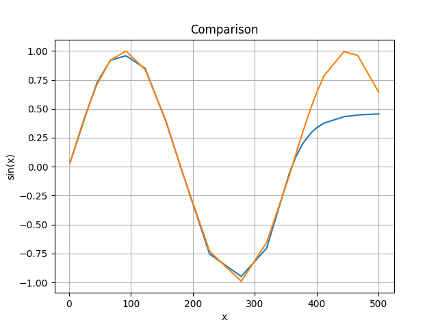

# Calculating sin(x) with a neural network

*Purpose: to train a neural network in order to calculate the function y=sin(x) where x is a number (an angle in radians).*

## Theoretical basics

### 1. Architecture

The architecture of the neural network is: 1 input layer, 1 hidden layer, and 1 output layer. The input layer is made of 1 single input neuron, the hidden layer contains 5 neurons, and the output layer again has just 1 neuron. The input neuron holds the value of the independant variable x, i.e. the angle in radians and the output neuron is the predicted value of sin(x).

The total number of parameters needed for this network is 16. We need 5 weight coeficients between the input layer and hidden layer, 5 biases for the hidden layer, 5 more weight coeficients between the hidden and output layer and 1 more bias for the output layer.

### 2. Activation function

The standard sigmoid function was used as an activation function: 
$$
\sigma(z) = \frac{1} {1 + e^{-z}}
$$
but since this function outputs values between 0 and 1, and the sin(x) has range [-1,1], I scaled it as $2\sigma(z) - 1$ and the used activation function is:
$$
f(z) = 2\sigma(z) - 1 = \frac{2} {1 + e^{-z}} - 1
$$

### 3. Forward pass
For an input x we have 5 activations in the hidden layer and 1 ouput value from the output neuron. To calculate the activation of the first neuron in the hidden layer first we calculate $z_{1}^{(2)}$ and then we calculate the activation $a_{1}^{(2)}$. Here, (2) in the upper right angle, and the 1 below it stands for first neuron from the second layer. We calculate these values like this:

$$ 
z_{1}^{(2)} = w_{1}^{(2)}x+b_{1}^{(2)}
$$

$$
a_{1}^{(2)} = f(z_{1}^{(2)})
$$

In matrix form for all 5 neurons:

$$
\begin{bmatrix}
z_{1}^{(2)} \\
z_{2}^{(2)} \\
z_{3}^{(2)} \\
z_{4}^{(2)} \\
z_{5}^{(2)}
\end{bmatrix} =

\begin{bmatrix}
w_{1}^{(2)} \\
w_{2}^{(2)} \\
w_{3}^{(2)} \\
w_{4}^{(2)} \\
w_{5}^{(2)}
\end{bmatrix} x +

\begin{bmatrix}
b_{1}^{(2)} \\
b_{2}^{(2)} \\
b_{3}^{(2)} \\
b_{4}^{(2)} \\
b_{5}^{(2)}
\end{bmatrix}
$$

$$
\begin{bmatrix}
a_{1}^{(2)} \\
a_{2}^{(2)} \\
a_{3}^{(2)} \\
a_{4}^{(2)} \\
a_{5}^{(2)}
\end{bmatrix} = 

f(
\begin{bmatrix}
z_{1}^{(2)} \\
z_{2}^{(2)} \\
z_{3}^{(2)} \\
z_{4}^{(2)} \\
z_{5}^{(2)}
\end{bmatrix})
$$

To calculate the activation of the output neuron, that is the prediction of sin(x) we first calculate:

$$
z = w_{1}^{(3)}a_{1}^{(2)} + w_{2}^{(3)}a_{2}^{(2)} + ... + w_{5}^{(3)}a_{5}^{(2)} + b^{(3)}
$$

In matrix form:

$$
z = 
\begin{bmatrix}
w_{1}^{(3)} & w_{2}^{(3)} & w_{3}^{(3)} & w_{4}^{(3)} & w_{5}^{(3)}
\end{bmatrix}

\begin{bmatrix}
a_{1}^{(2)} \\
a_{2}^{(2)} \\
a_{3}^{(2)} \\
a_{4}^{(2)} \\
a_{5}^{(2)}
\end{bmatrix} 

+ b^{(3)}
$$
And now, the activation of the output neuron, that is the prediction of the neural network for the sin(x) is:
$$
a = f(z)

To make the network "learn" we need to define something called a cost function:

$$
C = \frac{1} {2} (a - y)^{2}
$$

where $y$ stands for the true value of $sin(x)$, for example if $x=\frac{\pi} {2}$ then $y=1$. We need to minimize the value of the cost function. In order to that we need to find such weight coeficients and biases such that the value of the cost function be minimal. We need to update the parameters after each run of the network in order to change the cost function value. To do that we need the gradient of the cost function which is calculated using the backpropagation algorithm.

### 4. Backpropagation

The gradient of the cost function is:
$$
\nabla C = \frac{\partial C} {\partial w_{1}^{(3)}}\vec{e_{1}} +
           ... +
           \frac{\partial C} {\partial w_{5}^{(3)}}\vec{e_{5}} +
           \frac{\partial C} {\partial b^{(3)}}\vec{e_{6}} + \\
           \frac{\partial C} {\partial w_{1}^{(2)}}\vec{e_{7}} +
           \frac{\partial C} {\partial w_{2}^{(2)}}\vec{e_{8}} +
           ... +
           \frac{\partial C} {\partial w_{5}^{(2)}}\vec{e_{11}} + \\
           \frac{\partial C} {\partial b_{1}^{(2)}}\vec{e_{12}} +
           \frac{\partial C} {\partial b_{2}^{(2)}}\vec{e_{13}} +
           ... +
           \frac{\partial C} {\partial b_{5}^{(2)}}\vec{e_{16}}
$$

We will calculate the partial derivatives like this:
$$
\frac{\partial C} {\partial w_{1}^{(3)}} =
\frac{\partial C} {\partial a}
\frac{\partial a} {\partial z}
\frac{\partial z} {\partial w_{1}^{(3)}} =
(a - y)\left\{f'(z)\right\} a_{1}^{(2)} =
(a-y)\left\{2\sigma(z)(1-\sigma(z))\right\}a_{1}^{(2)}=
Aa_{1}^{(2)}
$$

here $A=(a-y)\left\{2\sigma(z)(1-\sigma(z))\right\}$. Analogous, we have: $\frac{\partial C} {\partial w_{2}^{(3)}} = Aa_{2}^{(2)}$, ...,
$\frac{\partial C} {\partial w_{5}^{(3)}} = Aa_{5}^{(2)}$.

For the partial derivative of $C$ in terms of $b$ we have:
$$
\frac{\partial C} {\partial b^{(3)}} =
\frac{\partial C} {\partial a}
\frac{\partial a} {\partial z}
\frac{\partial z} {\partial b^{(3)}} = A
$$

For the partial derivatives of $C$ in terms of $w_{i}^{(2)}$ we have:
$$
\frac{\partial C} {\partial w_{1}^{(2)}} =
\frac{\partial C} {\partial a}
\frac{\partial a} {\partial z}
\frac{\partial z} {\partial a_{1}^{(2)}}
\frac{\partial a_{1}^{(2)}} {\partial z_{1}^{(2)}}
\frac{\partial z_{1}^{(2)}} {\partial w_{1}^{(2)}} =
(a-y)f'(z)w_{1}^{(3)}f'(z_{1}^{(2)})x =
Aw_{1}^{(3)}
\left\{2\sigma(z_{1}^{(2)}) (1 - \sigma(z_{1}^{(2)}))\right\}x
$$

$$
\frac{\partial C} {\partial w_{2}^{(2)}} =
\frac{\partial C} {\partial a}
\frac{\partial a} {\partial z}
\frac{\partial z} {\partial a_{2}^{(2)}}
\frac{\partial a_{2}^{(2)}} {\partial z_{2}^{(2)}}
\frac{\partial z_{2}^{(2)}} {\partial w_{2}^{(2)}} =
(a-y)f'(z)w_{2}^{(3)}f'(z_{2}^{(2)})x =
Aw_{2}^{(3)}
\left\{2\sigma(z_{2}^{(2)}) (1 - \sigma(z_{2}^{(2)}))\right\}x
$$

$$ etc $$

For the partial derivatives of $C$ in terms of $b_{i}^{(2)}$ we have:
$$
\frac{\partial C} {\partial b_{1}^{(2)}} = 
\frac{\partial C} {\partial a}
\frac{\partial a} {\partial z}
\frac{\partial z} {\partial a_{1}^{(2)}}
\frac{\partial a_{1}^{(2)}} {\partial z_{1}^{(2)}}
\frac{\partial z_{1}^{(2)}} {\partial b_{1}^{(2)}} =
(a-y)f'(z)w_{1}^{(3)}f'(z_{1}^{(2)}) = 
Aw_{1}^{(3)}\left\{ 2\sigma(z_{1}^{(2)})(1- \sigma(z_{1}^{(2)}))\right\}
$$

$$
\frac{\partial C} {\partial b_{2}^{(2)}} = 
\frac{\partial C} {\partial a}
\frac{\partial a} {\partial z}
\frac{\partial z} {\partial a_{2}^{(2)}}
\frac{\partial a_{2}^{(2)}} {\partial z_{2}^{(2)}}
\frac{\partial z_{2}^{(2)}} {\partial b_{2}^{(2)}} =
(a-y)f'(z)w_{2}^{(3)}f'(z_{2}^{(2)}) = 
Aw_{2}^{(3)}\left\{ 2\sigma(z_{2}^{(2)})(1- \sigma(z_{2}^{(2)}))\right\}
$$

$$ etc $$

Finally for the gradient we have:

$$
\nabla C = A
\begin{bmatrix}
a_{1}^{(2)} \\
a_{2}^{(2)} \\
\vdots \\
a_{5}^{(2)} \\
1 \\
w_{1}^{(3)}2\sigma(z_{1}^{(2)})(1 - \sigma(z_{1}^{(2)}))x \\
\vdots \\
w_{5}^{(3)}2\sigma(z_{5}^{(2)})(1 - \sigma(z_{5}^{(2)}))x \\
w_{1}^{(3)}2\sigma(z_{1}^{(2)})(1 - \sigma(z_{1}^{(2)})) \\
\vdots \\
w_{5}^{(3)}2\sigma(z_{5}^{(2)})(1 - \sigma(z_{5}^{(2)}))
\end{bmatrix}
_{16 \times 1}

$$

Now, we update the parameters like this:

$$
\begin{bmatrix}
w_{1}^{(3)} \\
\vdots \\
w_{5}^{(3)} \\
b^{(3)} \\
w_{1}^{(2)} \\
\vdots \\
w_{5}^{(2)} \\
b_{1}^{(2)} \\
\vdots \\
b_{5}^{(2)} \\
\end{bmatrix}
_{new} =

\begin{bmatrix}
w_{1}^{(3)} \\
\vdots \\
w_{5}^{(3)} \\
b^{(3)} \\
w_{1}^{(2)} \\
\vdots \\
w_{5}^{(2)} \\
b_{1}^{(2)} \\
\vdots \\
b_{5}^{(2)} \\
\end{bmatrix}
_{old} - \eta \nabla C
$$

$\eta$ is a number which represents by how much we want to change the parameters. The success of the network depends on the value of $\eta$ we choose.

After repeating this process for each training example over many epochs, the network's parameters converge and the network successfully approximates sin(x).

## Training the network
In order to train the network, we need two arrays with data. The ```x``` array holds angles provided in degrees (the program converts them to radians) and ```y``` array holds the true values of ```sin(x)```.
```python
x = [0, 10, 20, 30, ..., 360]
y = [0, 0.1736, 0.3420, 0.5, ..., 0]
```
Then we initialize the network's parameters with random values.  We also define the number of epochs we want. An epoch is one single run through all training pairs. A training pair is (x, y(x)). The success of the neural network depends on the number of epochs we choose. Each epoch starts with total cost equal to 0, and that cost adds up after every run though a pair of training data. The parameters are also changed after every run though a pair of training data. Another thing that is important to say is that whether the parameters will converge also depend on the value of the learning rate. If we give a too small value the parameters will converge very slowly while if we give a very big value they may go over the convergence values and start to diverge again.

## Results

After training the network, we are given a set of parameters which we can use in order to test the network on data it has not seen before.

```python
test_angles = [2, 5, 18, 25, 45, 67, 92, 123, 157, 181, 227, 278, 319, 355, 366, 378, 391, 400, 412, 444, 466, 500]
learning_rate = 0.1
epochs = 10000
```
Using this test data (it goes beyond 360 because of generalization), a learning rate of 0.1 and 10000 epochs, when we plot Predicted values (blue) VS True values (orange) we get:



We can see that the neural network does relativly good on the interval [0, 360] but after that it does poorly. The reason is that the network was trained only on data from the interval [0, 360] and therefore has not learned to generalize beyond it.
